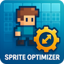
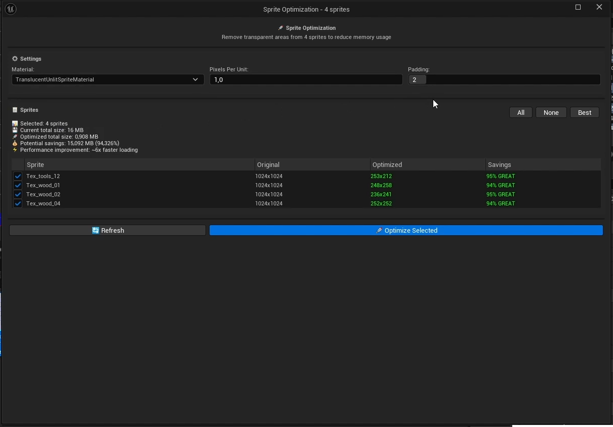
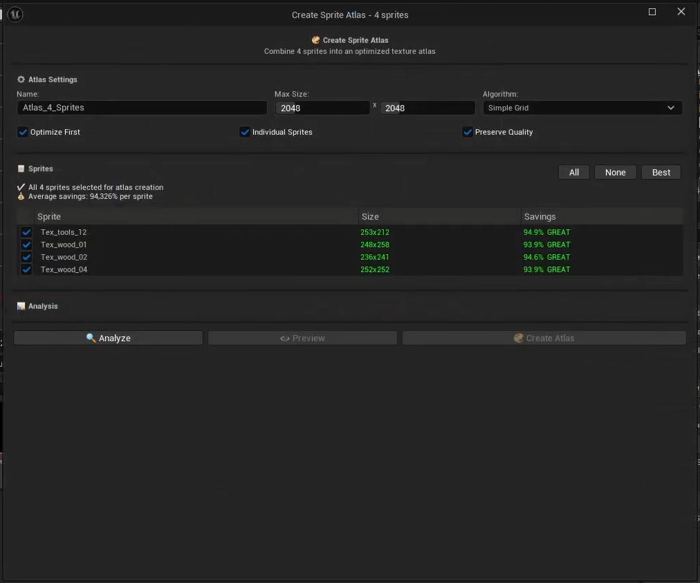

# EN
# Sprite Optimizer for Unreal Engine

**Sprite Optimizer** is a powerful plugin for Unreal Engine designed for 2D game developers. It provides a suite of tools to significantly reduce video memory usage and optimize performance by processing `PaperSprite` assets.

*A brief demonstration of the optimization and atlas creation process.*

---

## Table of Contents

- [About The Project](#about-the-project)
- [Key Features](#key-features)
- [Installation](#installation)
- [How To Use](#how-to-use)
  - [Optimizing Sprites](#optimizing-sprites)
  - [Creating Texture Atlases](#creating-texture-atlases)
- [Project Settings](#project-settings)
- [Technical Details](#technical-details)
- [Contact](#contact)

## About The Project

This tool was born out of necessity. During my own development process, I frequently encountered problems for which there were no ready-made solutions online. This led me to create my own tools to solve two main challenges:

1.  **Individual Sprite Optimization:** Automatically trims unused (transparent) areas of a texture while preserving the visual position of the **Pivot Point**.
2.  **Atlas Creation:** Combines multiple sprites into a single texture (an atlas) to reduce the number of **draw calls** and further decrease memory consumption.

## Key Features

-   ✅ **Intelligent Texture Trimming:** Deletes excess transparent pixels around the image.
-   ✅ **Pivot Point Preservation:** Automatically recalculates the `Pivot Point` so that the sprite remains in the same position in the game world after optimization.
-   ✅ **Advanced Atlas Creation:** A powerful tool for packing multiple sprites into a single atlas.
-   ✅ **Multiple Packing Algorithms:** Includes `Simple Grid`, `Best Fit`, and `MaxRects` for maximum space efficiency.
-   ✅ **One-Click "Quick Atlas":** Creates an atlas with optimal default settings without needing to open a separate window.
-   ✅ **Visual Preview:** Allows you to see what the atlas will look like before you create it.
-   ✅ **Flexible Settings:** Full control over the process through dedicated tool windows and Project Settings.
-   ✅ **Full Editor Integration:** All features are accessible via the context menu in the **Content Browser**.

## Installation

1.  Copy the `SpriteOptimizer` folder into your project's `Plugins` directory. (If a `Plugins` folder doesn't exist, create one in your project's root).
2.  Restart the Unreal Engine editor.
3.  The engine will prompt you to compile the plugin if necessary. Agree and wait for it to finish.
4.  The plugin is now ready to use!

## How To Use

All plugin features are available from the context menu that appears when you right-click on `UPaperSprite` assets in the **Content Browser**.

### Optimizing Sprites

This feature is ideal for sprites with a large amount of empty space around the main image.

1.  **Select** one or more sprites in the **Content Browser**.
2.  Right-click and choose **🚀 Optimize Sprite(s)**.
3.  The **Sprite Optimization** window will open.

#### Sprite Optimization Window

| Setting             | Description                                                                                               |
| :------------------ | :-------------------------------------------------------------------------------------------------------- |
| **Material**        | Allows you to select the material that will be applied to the new, optimized sprite.                      |
| **Pixels Per Unit** | Sets the sprite's scale in the game world.                                                                |
| **Padding**         | The number of pixels that will be added as a border around the trimmed image.                             |
| **🚀 Optimize Selected** | Starts the optimization process for all sprites checked in the list. |

After optimization, new assets with the `_Optimized` suffix will be created in an `Optimized` folder next to the original files.

### Creating Texture Atlases

Combining sprites into an atlas is one of the most effective ways to optimize 2D graphics.

1.  **Select** two or more sprites in the **Content Browser**.
2.  Right-click. You will see two new options:

#### ⚡ Quick Atlas

> Creates an atlas in one click using the most optimal default settings (`Best Fit` algorithm, automatic sprite optimization before packing). This is the fastest way to get a great result.

#### 🎨 Create Atlas from Sprites

> Opens the advanced **Create Sprite Atlas** window, where you can fine-tune every aspect of the atlas creation.

#### Create Sprite Atlas Window

**Atlas Settings:**

| Setting          | Description                                                                                                                                           |
| :--------------- | :---------------------------------------------------------------------------------------------------------------------------------------------------- |
| **Name**         | The name for your new atlas asset.                                                                                                                    |
| **Max Size**     | The maximum allowed resolution for the atlas texture (e.g., 2048x2048).                                                                              |
| **Algorithm**    | The algorithm used for packing sprites. **Best Fit** is recommended for most cases.                                                                   |
| **Optimize First** | **(Recommended)** If enabled, the plugin first optimizes each sprite individually before packing them. This yields the maximum space savings. |

**Actions:**

| Button             | Description                                                                                             |
| :----------------- | :------------------------------------------------------------------------------------------------------ |
| **🔍 Analyze**     | Analyzes the current settings and shows what the final atlas size and memory savings will be.             |
| **👁️ Preview**     | Becomes active after analysis. Opens a window that visually shows how the sprites will be laid out.       |
| **🎨 Create Atlas** | Starts the process of creating the atlas texture and all associated sprite assets.                        |

## Project Settings

You can configure the plugin's default behavior in **Edit -> Project Settings -> Plugins -> Sprite Optimizer**.

| Setting                         | Description                                                                               |
| :------------------------------ | :---------------------------------------------------------------------------------------- |
| **Default Material**            | The default material for all optimized sprites.                                           |
| **Default Padding**             | The default padding in pixels.                                                            |
| **Minimum Savings For Auto Select** | The minimum saving percentage required for a sprite to be selected with the "Best" button. |
| **Optimized Assets Path / Suffix** | Customize where optimized files are saved and what suffix they are given.                |

## Technical Details

#### How does Pivot Point Preservation work?

When the source texture is trimmed, its coordinate system changes. The plugin calculates the new pivot position relative to the top-left corner of the *trimmed* area and sets this value in the `Custom Pivot Point` mode. As a result, even though the texture and its dimensions have changed, the sprite remains visually in the same place in the game world.

#### Atlas Packing Algorithms

*   **Simple Grid:** Arranges sprites in a simple grid. Fast, but can be inefficient.
*   **Best Fit:** Finds the best available empty space for each sprite. A great balance between speed and efficiency.
*   **MaxRects:** The most complex algorithm that tracks all free rectangles to achieve the highest packing density.

## Contact

Project Link: [https://boosty.to/channel-jonathan-developer](https://boosty.to/channel-jonathan-developer)

# RU
# Sprite Optimizer for Unreal Engine

**Sprite Optimizer** — это мощный плагин для Unreal Engine, предназначенный для разработчиков 2D-игр. Он предоставляет набор инструментов для значительного сокращения использования видеопамяти и оптимизации производительности путем обработки ассетов `PaperSprite`.

[
*Краткая демонстрация процесса оптимизации и создания атласа.*](https://www.youtube.com/watch?v=39CtrqnF72Q)

---

## Оглавление

- [О проекте](#о-проекте)
- [Ключевые возможности](#ключевые-возможности)
- [Установка](#установка)
- [Как использовать](#как-использовать)
  - [Оптимизация спрайтов](#оптимизация-спрайтов)
  - [Создание текстурных атласов](#создание-текстурных-атласов)
- [Настройки проекта](#настройки-проекта)
- [Технические детали](#технические-детали)
- [Контакты](#контакты)

## О проекте

Этот инструмент был рожден из-за необходимости. В процессе собственной разработки я часто сталкиваюсь с проблемами, для которых нет готовых решений в интернете, что и привело меня к созданию собственных инструментов для решения двух основных задач:

1.  **Оптимизация отдельных спрайтов:** Автоматически обрезает неиспользуемые (прозрачные) области текстуры, сохраняя при этом визуальное положение **Pivot Point**.
2.  **Создание атласов:** Объединяет несколько спрайтов в единую текстуру (атлас), чтобы уменьшить количество вызовов отрисовки (**draw calls**) и еще больше сократить потребление памяти.

## Ключевые возможности

-   ✅ **Интеллектуальная обрезка текстур:** Удаляет лишние прозрачные пиксели вокруг изображения.
-   ✅ **Сохранение Pivot Point:** Автоматически пересчитывает `Pivot Point` так, что после оптимизации спрайт остается на том же месте в игровом мире.
-   ✅ **Создание атласов:** Продвинутый инструмент для упаковки множества спрайтов в один атлас.
-   ✅ **Несколько алгоритмов упаковки:** Включает `Simple Grid`, `Best Fit` и `MaxRects` для максимальной эффективности использования пространства.
-   ✅ **"Быстрый Атлас" в один клик:** Создает атлас с оптимальными настройками без необходимости открывать отдельное окно.
-   ✅ **Визуальный предпросмотр:** Позволяет увидеть, как будет выглядеть атлас, еще до его создания.
-   ✅ **Гибкие настройки:** Полный контроль над процессом через окна инструментов и настройки проекта.
-   ✅ **Полная интеграция с редактором:** Все функции доступны через контекстное меню в **Content Browser**.

## Установка

1.  Скопируйте папку `SpriteOptimizer` в директорию `Plugins` вашего проекта. (Если папки `Plugins` нет, создайте ее в корневой папке проекта).
2.  Перезапустите редактор Unreal Engine.
3.  Движок предложит скомпилировать плагин, если это необходимо. Согласитесь и дождитесь завершения.
4.  Плагин готов к использованию!

## Как использовать

Все функции плагина доступны из контекстного меню, которое появляется при нажатии правой кнопкой мыши на ассетах `UPaperSprite` в **Content Browser**.

### Оптимизация спрайтов

Эта функция идеально подходит для спрайтов с большим количеством пустого пространства вокруг основного изображения.

1.  **Выберите** один или несколько спрайтов в **Content Browser**.
2.  Нажмите правую кнопку мыши и выберите **🚀 Optimize Sprite(s)**.
3.  Откроется окно **Sprite Optimization**.

#### Окно Sprite Optimization

<!-- ЗАМЕНИТЕ ЭТО НА СКРИНШОТ ОКНА ОПТИМИЗАЦИИ -->

| Настройка           | Описание                                                                                               |
| :------------------ | :----------------------------------------------------------------------------------------------------- |
| **Material**        | Позволяет выбрать материал, который будет применен к новому, оптимизированному спрайту.                 |
| **Pixels Per Unit** | Устанавливает масштаб спрайта в игровом мире.                                                          |
| **Padding**         | Количество пикселей, которое будет добавлено в качестве отступа вокруг обрезанного изображения.         |
| **🚀 Optimize Selected** | Начинает процесс оптимизации для всех спрайтов, отмеченных галочкой в списке. |

После оптимизации в папке `Optimized` (рядом с исходными файлами) будут созданы новые ассеты с суффиксом `_Optimized`.

### Создание текстурных атласов

Объединение спрайтов в атлас — один из самых эффективных способов оптимизации 2D-графики.

1.  **Выберите** два или более спрайта в **Content Browser**.
2.  Нажмите правую кнопку мыши. У вас появятся две новые опции:

#### ⚡ Quick Atlas (Быстрый Атлас)

> Создает атлас в один клик, используя самые оптимальные настройки по умолчанию (алгоритм `Best Fit`, автоматическая оптимизация спрайтов перед упаковкой). Это самый быстрый способ получить отличный результат.

#### 🎨 Create Atlas from Sprites (Создать Атлас)

> Открывает продвинутое окно **Create Sprite Atlas**, где вы можете тонко настроить каждый аспект создания атласа.

#### Окно Create Sprite Atlas

<!-- ЗАМЕНИТЕ ЭТО НА СКРИНШОТ ОКНА СОЗДАНИЯ АТЛАСА -->

**Настройки атласа:**

| Настройка        | Описание                                                                                                                                              |
| :--------------- | :---------------------------------------------------------------------------------------------------------------------------------------------------- |
| **Name**         | Имя для вашего нового атласа.                                                                                                                         |
| **Max Size**     | Максимально допустимое разрешение текстуры атласа (например, 2048x2048).                                                                             |
| **Algorithm**    | Алгоритм упаковки спрайтов. **Best Fit** рекомендуется для большинства случаев.                                                                       |
| **Optimize First** | **(Рекомендуется)** Если включено, плагин сначала оптимизирует каждый спрайт, а уже потом упакует их. Это дает максимальную экономию места. |

**Действия:**

| Кнопка             | Описание                                                                                             |
| :----------------- | :--------------------------------------------------------------------------------------------------- |
| **🔍 Analyze**     | Анализирует настройки и показывает, какого размера получится атлас и сколько памяти вы сэкономите.     |
| **👁️ Preview**     | После анализа эта кнопка становится активной. Открывает окно, где визуально показано расположение спрайтов. |
| **🎨 Create Atlas** | Начинает процесс создания атласа и всех необходимых ассетов.                                          |

## Настройки проекта

Вы можете настроить поведение плагина по умолчанию в настройках проекта: **Edit -> Project Settings -> Plugins -> Sprite Optimizer**.

| Настройка                        | Описание                                                                                      |
| :------------------------------- | :-------------------------------------------------------------------------------------------- |
| **Default Material**             | Материал по умолчанию для всех оптимизированных спрайтов.                                     |
| **Default Padding**              | Отступ в пикселях по умолчанию.                                                               |
| **Minimum Savings For Auto Select** | Минимальный процент экономии для автоматического выбора спрайтов по кнопке "Best".           |
| **Optimized Assets Path / Suffix** | Позволяет настроить, куда сохранять оптимизированные файлы и какой суффикс им присваивать. |

## Технические детали

#### Как работает сохранение Pivot Point?

Когда исходная текстура обрезается, ее система координат меняется. Плагин вычисляет новое положение пивота относительно левого верхнего угла *обрезанной* области и устанавливает его в режиме `Custom Pivot Point`. В результате, хотя текстура и ее размеры изменились, визуально в игровом мире спрайт остается на своем месте.

#### Алгоритмы упаковки атласа

*   **Simple Grid:** Располагает спрайты в простой сетке. Быстро, но неэффективно.
*   **Best Fit:** Ищет наилучшее свободное место для каждого спрайта. Отличный баланс между скоростью и эффективностью.
*   **MaxRects:** Самый сложный алгоритм, который отслеживает все свободные прямоугольники для достижения максимальной плотности упаковки.

## Контакты

Ссылка на проект: [https://boosty.to/channel-jonathan-developer](https://boosty.to/channel-jonathan-developer)
