# Sprite Optimizer for Unreal Engine

  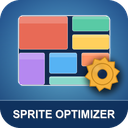

  
  
  

**Sprite Optimizer** is a professional Paper2D sprite and texture optimization plugin for Unreal Engine 5. It provides a complete suite of tools for trimming transparent regions, packing textures into atlases, creating Material Instances, and reverse-engineering existing atlases.

---

## Table of Contents

- [Key Features](#key-features)
- [Installation](#installation)
- [Getting Started](#getting-started)
- [Optimize Mode](#optimize-mode)
- [Atlas Mode](#atlas-mode)
- [Import Atlas](#import-atlas)
- [Quick Atlas](#quick-atlas)
- [Export & Output](#export--output)
- [Keyboard Shortcuts & Mouse Controls](#keyboard-shortcuts--mouse-controls)
- [Project Settings](#project-settings)
- [Technical Details](#technical-details)

---

## Key Features

- **Intelligent Texture Trimming** — automatically removes transparent pixels with configurable alpha threshold
- **Pivot Point Preservation** — recalculates pivot so sprites maintain their visual position after trimming
- **5 Packing Algorithms** — Max Rects, Bin Pack, Fixed Grid, Tile, with multi-heuristic optimization
- **Interactive Atlas Editor** — drag, resize, rotate, repack items on a visual canvas
- **Import Atlas** — reverse-engineer existing atlases from Sprites, Material Instances, or auto-detect regions
- **Grid Slice Dialog** — slice any texture into regions with Auto-detect (flood fill) or Grid mode
- **Material Instance Generation** — create MI assets with UV-offset parameters for atlas regions
- **Multi-Pack** — automatically creates additional atlas pages when items don't fit
- **Memory Safety** — RAM usage estimation with warning dialogs before heavy operations
- **Detailed Progress Bars** — 4-phase progress tracking so you always know what's happening
- **BC7 Compression** — all exported textures use high-quality BC7 compression
- **Drag & Drop** — add textures from Content Browser directly into the editor
- **Full Undo/Redo** — up to 50 undo levels for all canvas operations

---

## Installation

1. Copy the `SpriteOptimizer` folder into your project's `Plugins` directory
2. Restart the Unreal Engine editor
3. The plugin will compile automatically on first launch
4. Access all features via right-click context menu in Content Browser

---

## Getting Started

Select textures or sprites in the **Content Browser**, right-click, and choose from the **Sprite Optimizer** section:

  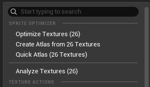
  &nbsp;&nbsp;&nbsp;
  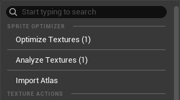

*Left: Multiple textures selected (Optimize, Atlas, Quick Atlas, Analyze). Right: Single texture selected (also shows Import Atlas).*

---

## Optimize Mode

Trim transparent pixels from individual textures while preserving sprite pivot positions.

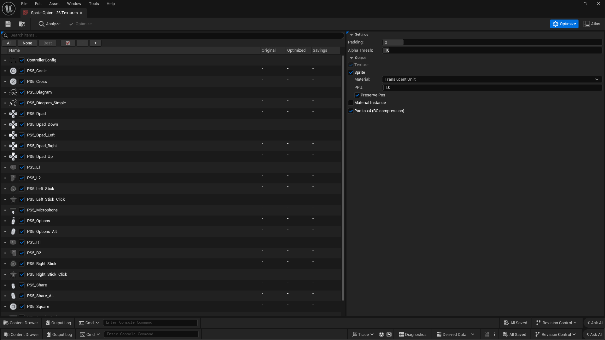

*Optimize editor before analysis — select items and configure settings.*

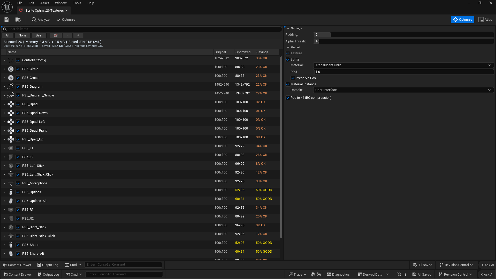

*After analysis: savings percentage, original vs optimized sizes, memory estimates. Yellow = good savings, orange = negative (padding inflated size).*

Switch between modes:

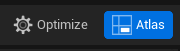

---

## Atlas Mode

Pack multiple textures into optimized atlas sheets.

### Atlas Editor Overview

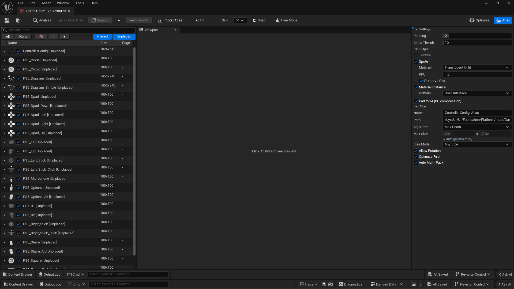

*Items panel (left) — check/uncheck, search, filter Placed/Unplaced. Viewport (center) — interactive canvas. Settings (right) — algorithm, size, output options.*

### Toolbar

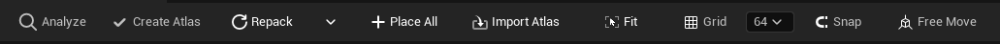

| Button | Shortcut | Description |
|--------|----------|-------------|
| Analyze | `F5` | Run packing algorithm and display preview |
| Create Atlas | `Ctrl+Shift+Enter` | Export atlas texture, sprites, and material instances |
| Repack | `Ctrl+R` | Re-run packing on current page items |
| Place All | — | Place all unplaced items on the current page |
| Import Atlas | — | Import an existing atlas texture |
| Fit | `Home` | Fit view to show entire atlas |
| Grid | `G` | Toggle grid overlay |
| Snap | `S` | Toggle snap-to-grid |
| Free Move | `F` | Toggle free movement mode (no collision) |

### Packing Algorithms

| Algorithm | Best For |
|-----------|----------|
| **Max Rects** | General-purpose. Multi-heuristic (5 heuristics × 4 sort orders). Industry standard. |
| **Bin Pack** | Anchor-point algorithm. Good for diverse sizes. |
| **Fixed Grid** | Uniform N×M grid. Best for tile-based games. |
| **Tile (Simple)** | Horizontal/vertical strip. Best for linear layouts. |

### Canvas Interaction

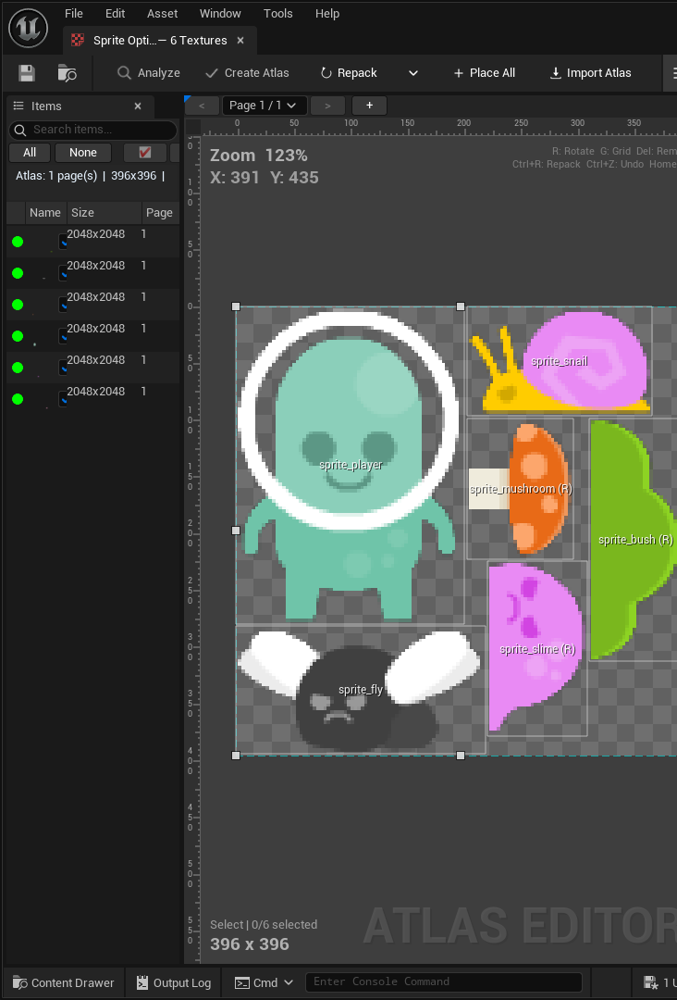

*All textures packed with Optimize First + Allow Rotation. Names shown on each item.*

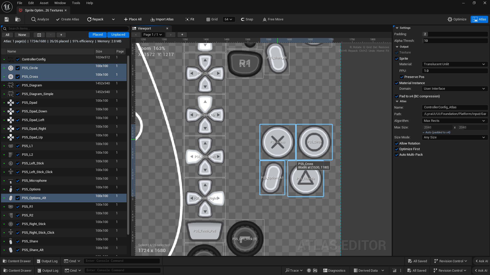

*Multi-select with rubber band. Selected items highlighted with blue outline.*

### Multi-Pack

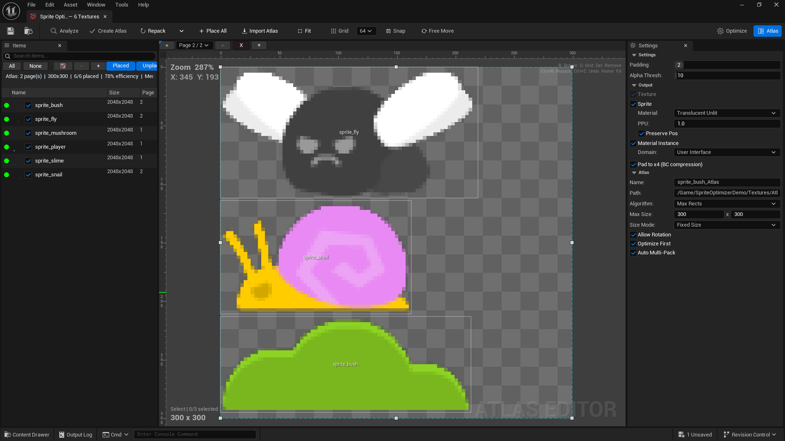

*Navigate between pages using the tab bar. Page 3 of 6 shown.*

### Collision Detection

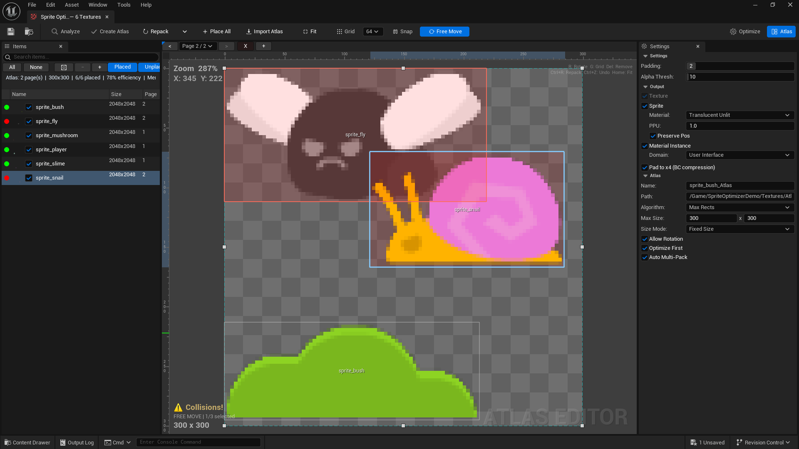

*Overlapping items shown with red outlines. "Collisions!" warning in status bar. Enable Free Move to allow overlaps.*

### Drag & Drop

Add textures dynamically — drag from Content Browser into the Items panel:

  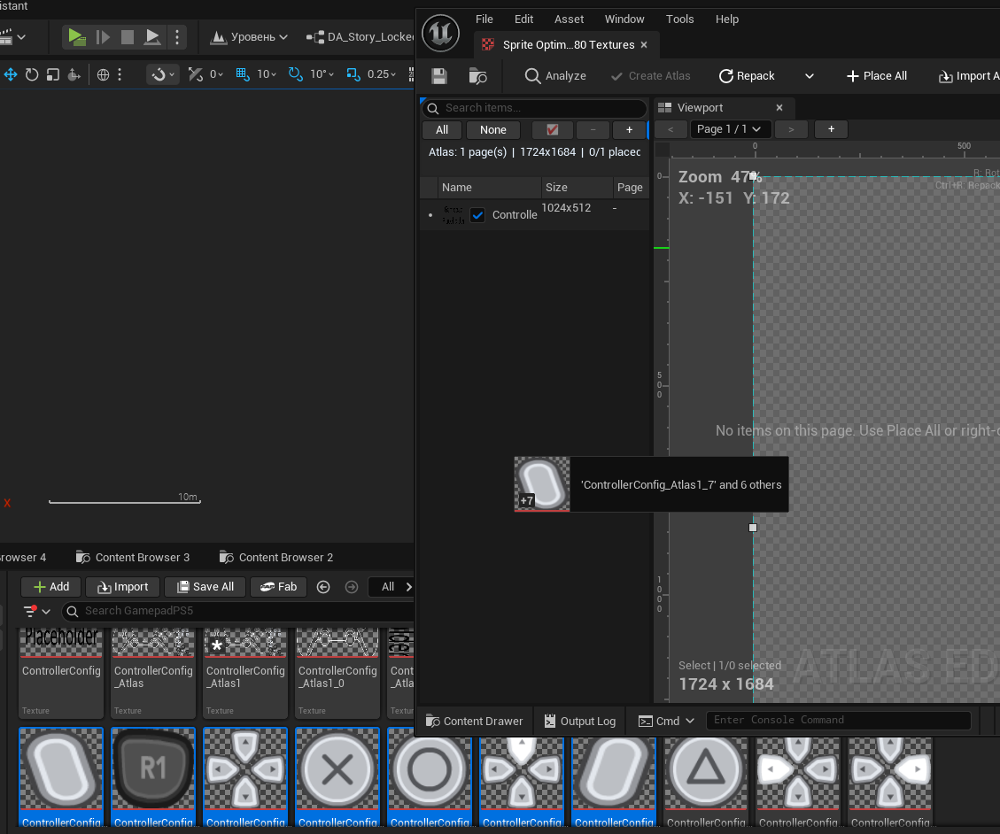
  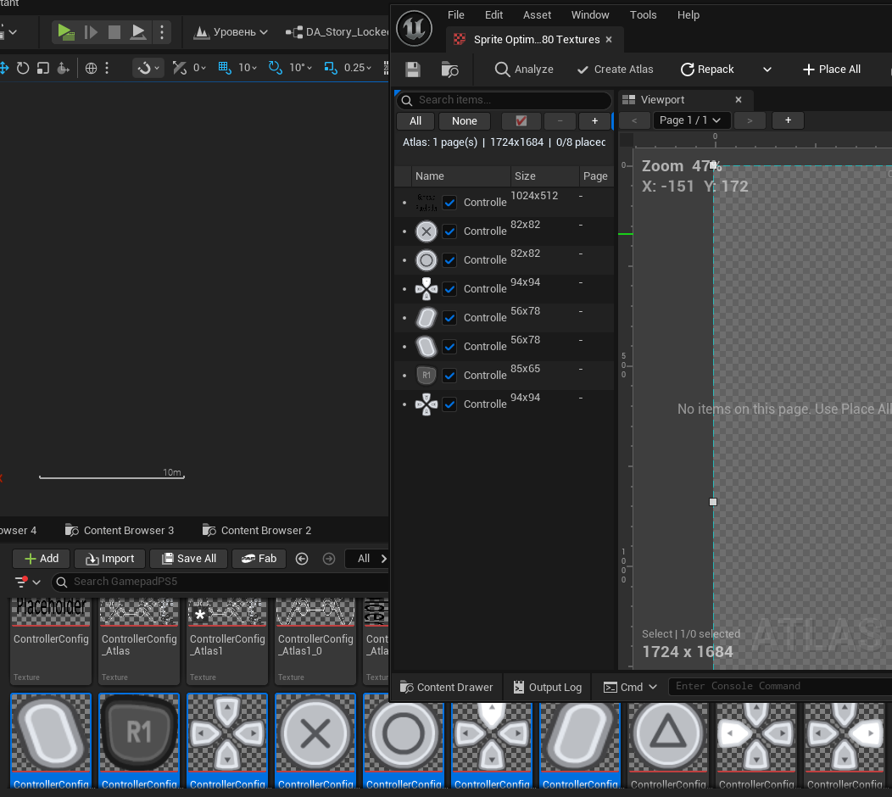

*Left: Dragging 7 textures into Items. Right: Items added as Unplaced — use Place All or Analyze to pack.*

---

## Import Atlas

Reverse-engineer existing atlas textures back into individual editable items.

Right-click on an atlas texture → **Import Atlas**.

### From Sprites / Material Instances

When Sprites or MI reference the atlas texture, a source selection dialog appears:

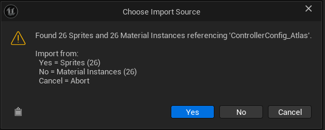

*Choose Sprites (Yes), Material Instances (No), or Cancel.*

### Slice Texture Dialog

When no metadata found, the **Slice Texture** dialog opens:

#### Auto Mode — Flood-Fill Island Detection

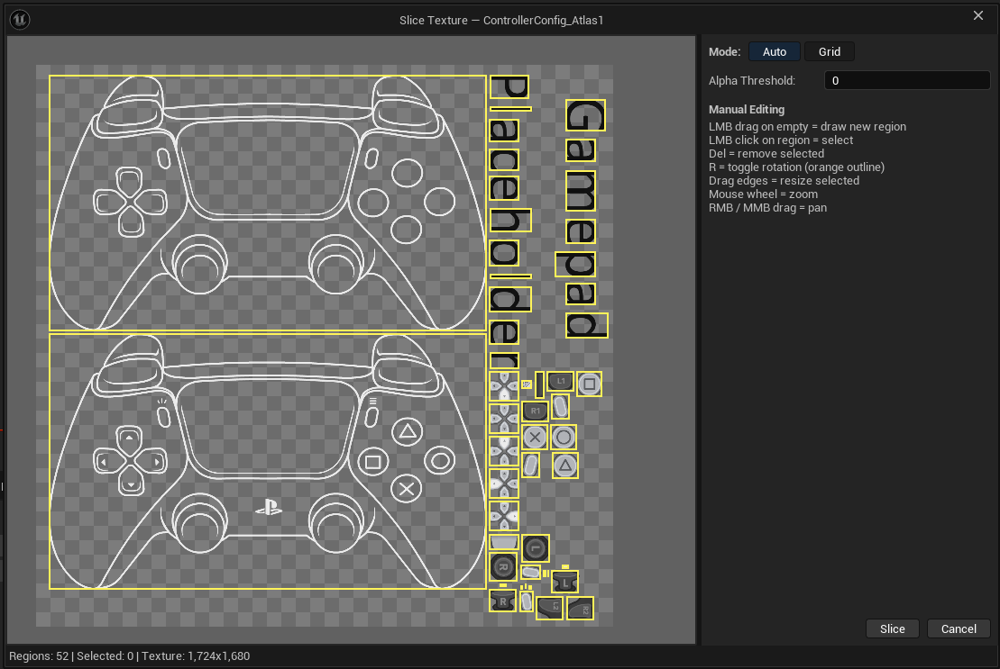

*Yellow outlines = auto-detected regions by alpha transparency. Alpha Threshold configurable.*

#### Grid Mode — Uniform Cell Slicing

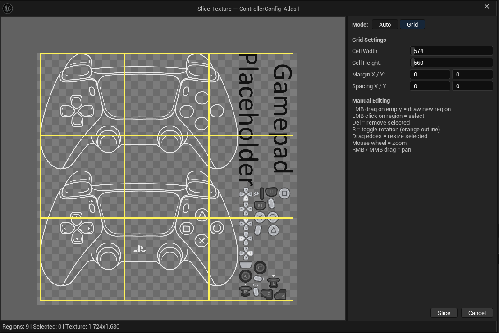

*Grid mode with configurable Cell Width/Height, Margin, and Spacing.*

#### Manual Editing

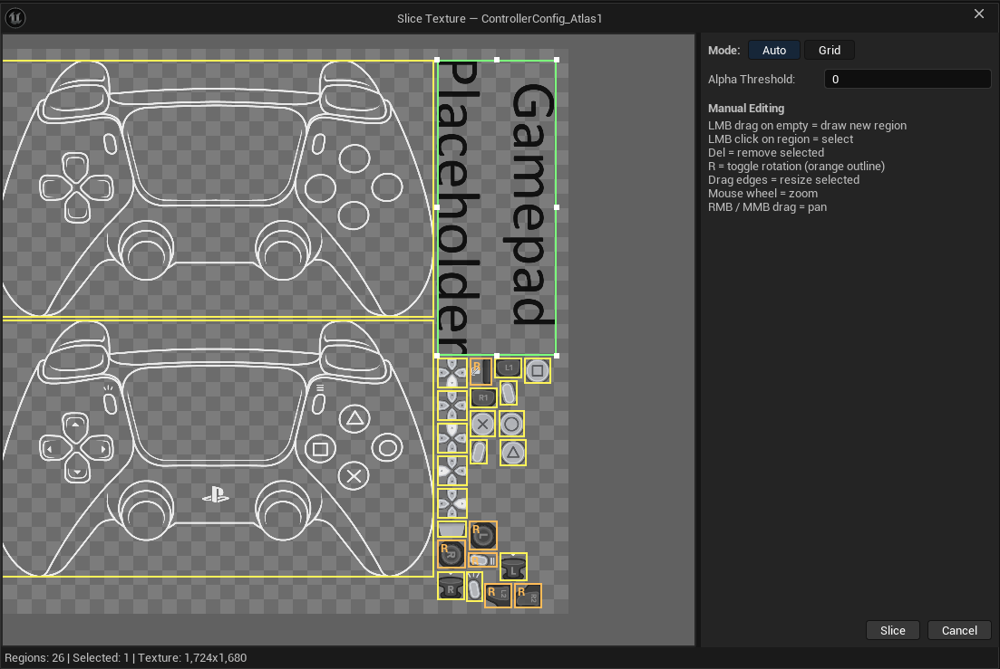

*Green = selected region. Orange with "R" = marked as rotated. Draw, delete, resize any region.*

| Action | How |
|--------|-----|
| Select region | LMB click on region |
| Draw new region | LMB drag on empty space |
| Delete region | Select → `Del` |
| Resize region | Drag edges/corners of selected |
| Mark as rotated | Select → `R` (unrotates on export) |
| Zoom / Pan | Mouse wheel / RMB or MMB drag |

After **Slice**, textures are saved to a `Sliced/` subfolder and a new Atlas Editor opens with them.

---

## Quick Atlas

Create an atlas in one click: select 2+ textures → right-click → **Quick Atlas**.

Uses defaults from Project Settings (algorithm, size mode, padding, etc). Atlas created instantly in the same folder.

---

## Export & Output

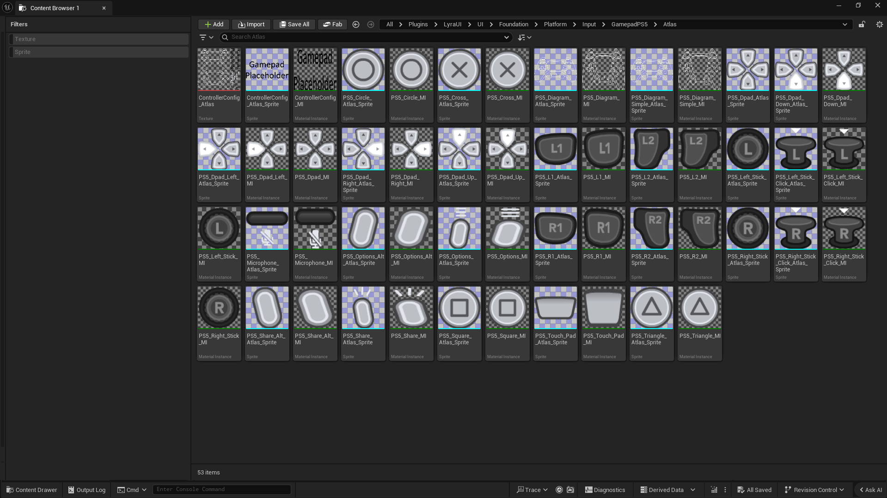

*Content Browser showing exported atlas texture, sprites, and material instances.*

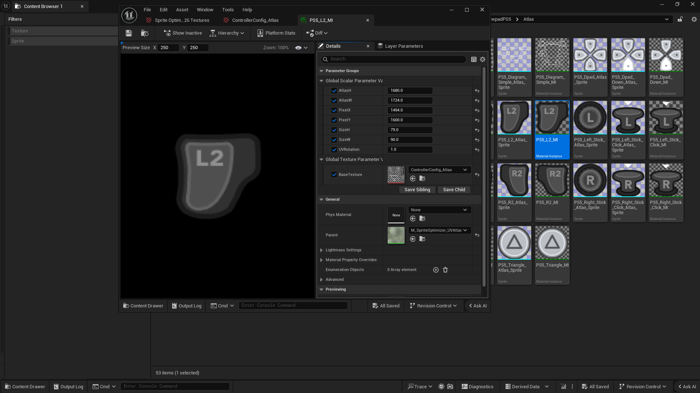

*Material Instance with pixel-based UV parameters: PixelX/Y, SizeW/H, AtlasW/H, UVRotation.*

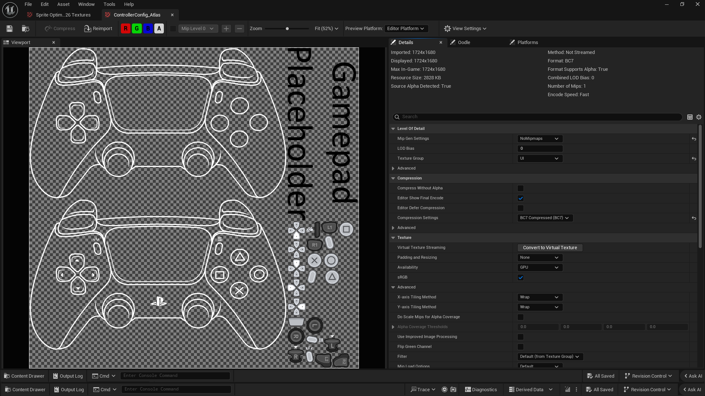

*Exported texture: BC7 compression, NoMipmaps, UI texture group.*

### Output Options

| Option | Description |
|--------|-------------|
| **Texture** | Always created — atlas texture with BC7 compression |
| **Sprite** | PaperSprite assets with correct SourceUV and pivot |
| **Material Instance** | MI with UV-offset parameters for UMG widgets |
| **Preserve Position** | Adjust pivot to maintain visual position after trimming |
| **Pad to x4** | Ensure dimensions are multiple of 4 for BC compression |

---

## Keyboard Shortcuts & Mouse Controls

### Global Commands

| Shortcut | Action |
|----------|--------|
| `F5` | Analyze (run packing / optimization) |
| `Ctrl+Shift+Enter` | Create Atlas / Execute Optimize |
| `Ctrl+R` | Repack current page |
| `Ctrl+Z` | Undo |
| `Ctrl+Y` | Redo |
| `Ctrl+A` | Select all items on current page |

### Canvas Navigation

| Input | Action |
|-------|--------|
| `Mouse Wheel` | Zoom in/out |
| `MMB Drag` | Pan viewport |
| `RMB Drag` | Pan viewport (alternative) |
| `Home` | Fit view to atlas |

### Canvas Editing

| Input | Action |
|-------|--------|
| `LMB Click` | Select item |
| `Ctrl+LMB Click` | Toggle item in selection (add/remove) |
| `LMB Drag` (on empty) | Rubber band selection |
| `Ctrl+LMB Drag` | Additive rubber band (XOR toggle) |
| `LMB Drag` (on item) | Move selected items |
| `Shift+Drag` | **Axis lock** — constrain movement to horizontal OR vertical (auto-detects direction, shows magenta guide line) |
| `Shift+Resize` | **Proportional resize** — constrain canvas resize to square proportions |
| `Ctrl+Drag` | Force snap-to-grid (even if Snap toggle is off) |

### Item Operations

| Shortcut | Action |
|----------|--------|
| `R` | Rotate selected 90° clockwise |
| `Del` | Remove selected from atlas (→ Unplaced) |

### View Toggles

| Shortcut | Action |
|----------|--------|
| `G` | Toggle grid overlay |
| `S` | Toggle snap-to-grid |
| `F` | Toggle free movement (disable collision) |
| `P` | Toggle rulers |

### Slice Dialog Controls

| Input | Action |
|-------|--------|
| `LMB Click` | Select region |
| `LMB Drag` (empty) | Draw new region |
| `Del` | Delete selected region |
| `R` | Toggle rotation mark on selected |
| `Mouse Wheel` | Zoom |
| `RMB / MMB Drag` | Pan |

---

## Memory Safety

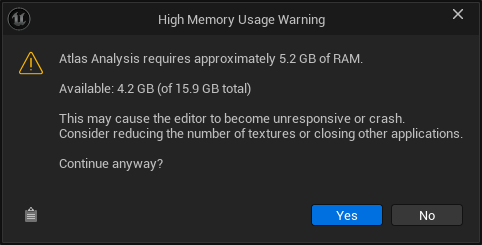

*RAM estimation before heavy operations. Shows required vs available memory.*

---

## Project Settings

Configure defaults in **Project Settings → Plugins → Sprite Optimizer**:

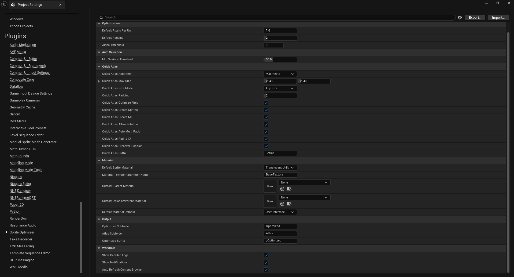

| Category | Settings |
|----------|----------|
| **Optimization** | Default Pixels Per Unit, Padding, Alpha Threshold |
| **Auto Selection** | Min Savings Threshold for auto-select |
| **Quick Atlas** | Algorithm, Max Size, Size Mode, Padding, Optimize First, Allow Rotation, Auto Multi-Pack, Pad to x4, Preserve Position, Suffix |
| **Material** | Default Sprite Material, Texture Parameter Name, Custom Parent Materials, Material Domain |
| **Output** | Optimized/Atlas subfolder names, Optimized suffix |
| **Workflow** | Show Detailed Logs, Show Notifications, Auto Refresh Content Browser |

---

## Technical Details

| Property | Value |
|----------|-------|
| Engine Version | Unreal Engine 5.4+ |
| Module Type | Editor Only (EditorNoCommandlet) |
| Dependencies | Paper2D |
| Platforms | Win64, Mac, Linux |
| Compression | BC7 for all exported textures |
| Max Atlas Size | Up to 8192×8192 (configurable) |
| Packing Optimization | Multi-heuristic with aspect ratio scoring |
| Progress Tracking | 4-phase progress bars for all heavy operations |
| Undo System | 50-level undo/redo stack |

---

**Created by CRAFTCODE** | Sprite Optimizer v2.0
