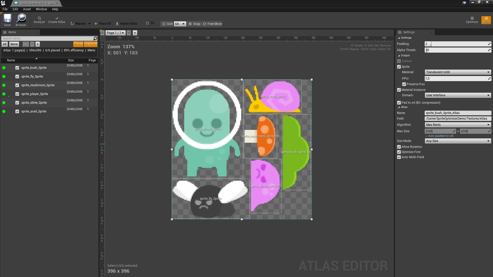
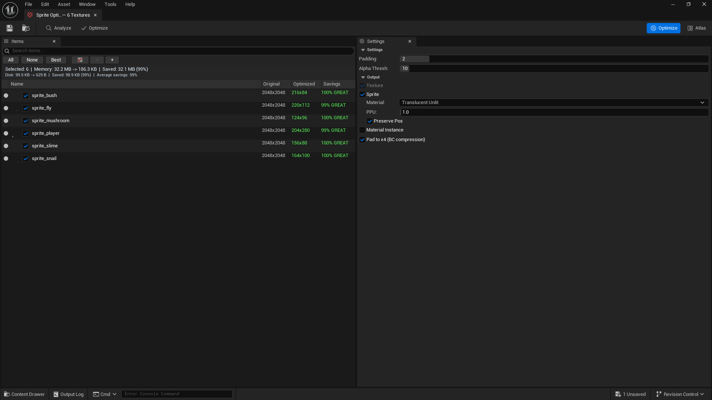
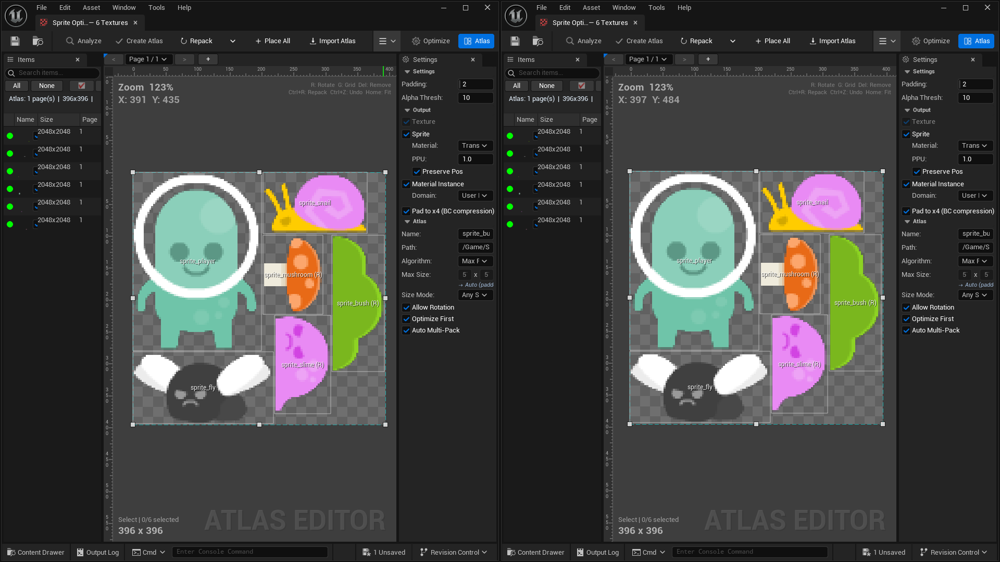
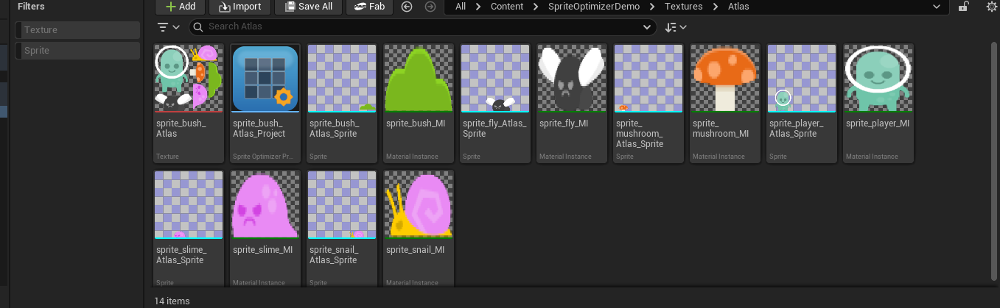
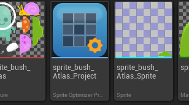
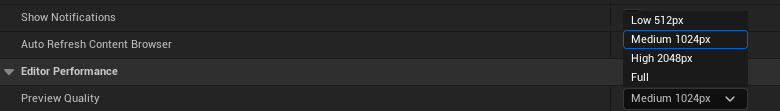

# Sprite Optimizer for Unreal Engine

<p align="center">
  
</p>

<p align="center">
  
  
  
  
</p>

<p align="center">
  <a href="https://www.fab.com/listings/d467cf90-8576-4aa9-b55d-285060a5d1bf"><b>▶ Get it on FAB Marketplace</b></a>
</p>

**Sprite Optimizer** is a professional Paper2D sprite and texture optimization plugin for Unreal Engine. It provides a complete suite of tools for trimming transparent regions, packing textures into atlases, creating Material Instances, and reverse-engineering existing atlases — all in a single interactive editor with full undo/redo support.

> **Version 2.1** — Now works on **9 engine versions** (UE 4.27 and 5.0 through 5.7) from a single unified source. Adds the **Sprite Optimizer Project** asset for resumable editing sessions, faster project opening on large atlases, configurable **Preview Quality** setting for memory control, 16-bit normal map support, and several stability fixes. See [Changelog](#changelog) for details.

---

## Table of Contents

- [Key Features](#key-features)
- [Supported Engine Versions](#supported-engine-versions)
- [Getting Started](#getting-started)
- [Optimize Mode](#optimize-mode)
- [Atlas Mode](#atlas-mode)
- [Sprite Optimizer Project](#sprite-optimizer-project)
- [Import Atlas](#import-atlas)
- [Quick Atlas](#quick-atlas)
- [Export & Output](#export--output)
- [Preview Quality](#preview-quality)
- [Keyboard Shortcuts & Mouse Controls](#keyboard-shortcuts--mouse-controls)
- [Project Settings](#project-settings)
- [Technical Details](#technical-details)
- [Changelog](#changelog)
- [Troubleshooting](#troubleshooting)

---

## Key Features

- **Works on UE 4.27 and 5.0 through 5.7** — one plugin, every supported engine version
- **Pixel-perfect output** — your sprites are never scaled, resampled, or filtered; what you put in is what comes out
- **Automatic trimming** — removes transparent edges from textures with a configurable alpha threshold
- **Pivot preservation** — trimmed sprites stay in the same visual position as before
- **4 packing algorithms** — Max Rects, Bin Pack, Fixed Grid, Tile — pick the one that fits your project
- **Interactive atlas editor** — drag items to reposition, rotate 90°, multi-select, resize the atlas page in real time
- **Resumable sessions** 🆕 — save your editing session as an asset and reopen it later with one double-click
- **Import existing atlases** — reverse-engineer an atlas back into individual editable items
- **Slice any texture** — cut a texture into regions with auto-detect (flood fill) or grid mode
- **Material Instances** — auto-generated with pixel-based UV parameters, works in both 3D and UMG
- **Multi-page atlases** — automatically creates extra pages when items don't fit
- **Normal maps & HDR** 🆕 — 16-bit sources and HDR textures now pack correctly
- **Fast project loading** 🆕 — parallel pixel decompression speeds up reopening large atlases
- **Preview Quality setting** 🆕 — control editor memory usage; no impact on final output
- **Memory warnings** — before a heavy operation, you'll see how much RAM is needed
- **BC7 compression** — high-quality compression with alpha for all exported textures
- **Drag & drop** — pull textures from Content Browser straight into the editor
- **50-level undo/redo** — experiment freely; take back any action

---

## Supported Engine Versions

| Engine | Status | Notes |
|--------|--------|-------|
| **UE 4.27** | ✅ Supported | Full feature set via compatibility layer |
| **UE 5.0** | ✅ Supported | |
| **UE 5.1** | ✅ Supported | |
| **UE 5.2** | ✅ Supported | |
| **UE 5.3** | ✅ Supported | |
| **UE 5.4** | ✅ Supported | |
| **UE 5.5** | ✅ Supported | |
| **UE 5.6** | ✅ Supported | |
| **UE 5.7** | ✅ Supported | Development baseline |

All versions receive identical features — cross-engine compatibility is handled internally, no per-version branches in user-facing code.

<p align="center">
  
</p>

*Plugin running in **UE 4.27** — same Atlas Editor, same workflow, same source code. No separate build for older engine versions.*

---

## Getting Started

Select textures or sprites in the **Content Browser**, right-click, and choose from the **Sprite Optimizer** section:

<p align="center">
  
  &nbsp;&nbsp;&nbsp;
  
</p>

*Left: Multiple textures selected (Optimize, Atlas, Quick Atlas, Analyze). Right: Single texture selected (also shows Import Atlas).*

---

## Optimize Mode

Trim transparent pixels from individual textures while preserving sprite pivot positions.



*Real example: 6 textures (2048×2048 each) trimmed to their actual content. **32.2 MB → 186 KB memory footprint** (99% savings). **Preserve Pos ✓** keeps sprite visual positions intact — composition in scene never breaks.*


*Optimize editor before analysis — select items and configure settings.*


*After analysis: savings percentage, original vs optimized sizes, memory estimates. Yellow = good savings, orange = negative (padding inflated size).*

Switch between modes:


---

## Atlas Mode

Pack multiple textures into optimized atlas sheets.

### Atlas Editor Overview


*Items panel (left) — check/uncheck, search, filter Placed/Unplaced. Viewport (center) — interactive canvas. Settings (right) — algorithm, size, output options.*

### Toolbar


| Button | Shortcut | Description |
|--------|----------|-------------|
| Analyze | `F5` | Run packing algorithm and display preview |
| Create Atlas | `Ctrl+Shift+Enter` | Export atlas texture, sprites, and material instances |
| Repack | `Ctrl+R` | Re-run packing on current page items |
| Place All | — | Place all unplaced items on the current page |
| Import Atlas | — | Import an existing atlas texture |
| Fit | `Home` | Fit view to show entire atlas |
| Grid | `G` | Toggle grid overlay |
| Snap | `S` | Toggle snap-to-grid |
| Free Move | `F` | Toggle free movement mode (no collision) |

### Packing Algorithms

| Algorithm | Best For |
|-----------|----------|
| **Max Rects** | General-purpose. Multi-heuristic (5 heuristics × 4 sort orders). Industry standard. |
| **Bin Pack** | Anchor-point algorithm. Good for diverse sizes. |
| **Fixed Grid** | Uniform N×M grid. Best for tile-based games. |
| **Tile (Simple)** | Horizontal/vertical strip. Best for linear layouts. |

### Canvas Interaction


*All textures packed with Optimize First + Allow Rotation. Names shown on each item.*


*Multi-select with rubber band. Selected items highlighted with blue outline.*

> **Note on "resize":** In the Atlas Editor, you can resize the **target atlas page** (e.g. change from 1024×1024 to 2048×1024). Individual sprite pixels are never scaled — items only move, rotate 90° for packing, and fit within the page boundary. Output preserves 1:1 pixel quality.

### Multi-Pack


*Navigate between pages using the tab bar. Page 3 of 6 shown.*

### Collision Detection


*Overlapping items shown with red outlines. "Collisions!" warning in status bar. Enable Free Move to allow overlaps.*

### Drag & Drop

Add textures dynamically — drag from Content Browser into the Items panel:

<p align="center">
  
  
</p>

*Left: Dragging 7 textures into Items. Right: Items added as Unplaced — use Place All or Analyze to pack.*

---

## Sprite Optimizer Project

Save your editing session as an asset in Content Browser so you can come back to it later.



*Double-click a Project asset and the editor opens with everything restored — same layout, same items, same settings. Left window: original session. Right window: freshly opened from the Project asset. Byte-for-byte identical state.*

### Why you'd want this

Before v2.1, the only way to resume editing a saved atlas was to re-import it. That re-detects regions from the atlas texture — slow for large atlases, and any manual tweaks (moves, resizes, rotations) had to be redone.

With the new **Project asset** everything is preserved: the layout you set up, page sizes, trim state per item, checkboxes, and all settings. Double-click the project and you're back exactly where you left off.

### How to use it

**It's automatic.** Every time you run **Create Atlas**, the plugin saves a `_Project.uasset` next to your atlas:

```
Content/YourFolder/Atlas/
├── MyAtlas.uasset              ← the atlas texture
├── MyAtlas_Project.uasset      🆕 ← your editing session (new!)
├── MyAtlas_Sprite1.uasset      ← sprites (as before)
└── MyAtlas_Sprite1_MI.uasset   ← material instances (as before)
```

To reopen an editing session, **double-click the `_Project.uasset`** in Content Browser. The editor opens with your layout restored.



*Content Browser view after Create Atlas: atlas texture + `_Project` asset + sprites + material instances, all in one folder.*

### Saving mid-edit

You can also save your work without running Create Atlas — just press **Save** (or `Ctrl+S`) in the toolbar. Useful for trying out a different layout without losing your current one.

### Open Project shortcut

After Create Atlas finishes, the success notification shows an **"Open Project"** link. Clicking it opens the project in a fresh window — handy when you've been editing a big atlas and want to start with a clean memory state.

### Custom icon

Project assets have their own icon (blue tile with atlas grid + gear) so you can spot them at a glance in Content Browser. Right-click a project and you'll see **"Open Generated Atlas"** which jumps to the atlas that came out of that session.

<p align="center">
  
</p>

*Close-up: atlas texture (left) next to its Project asset (right). The blue gear thumbnail makes it unmistakable.*

---

## Import Atlas

Reverse-engineer existing atlas textures back into individual editable items.

Right-click on an atlas texture → **Import Atlas**.

### From Sprites / Material Instances

When Sprites or MI reference the atlas texture, a source selection dialog appears:


*Choose Sprites (Yes), Material Instances (No), or Cancel.*

### Slice Texture Dialog

When no metadata found, the **Slice Texture** dialog opens:

#### Auto Mode — Flood-Fill Island Detection


*Yellow outlines = auto-detected regions by alpha transparency. Alpha Threshold configurable.*

#### Grid Mode — Uniform Cell Slicing


*Grid mode with configurable Cell Width/Height, Margin, and Spacing.*

#### Manual Editing


*Green = selected region. Orange with "R" = marked as rotated. Draw new regions, delete, or adjust their crop rectangles (does not alter underlying texture pixels).*

| Action | How |
|--------|-----|
| Select region | LMB click on region |
| Draw new region | LMB drag on empty space |
| Delete region | Select → `Del` |
| Resize region | Drag edges/corners of selected (adjusts crop rectangle, not pixels) |
| Mark as rotated | Select → `R` (unrotates on export) |
| Zoom / Pan | Mouse wheel / RMB or MMB drag |

After **Slice**, textures are saved to a `Sliced/` subfolder and a new Atlas Editor opens with them.

---

## Quick Atlas

Create an atlas in one click: select 2+ textures → right-click → **Quick Atlas**.

Uses defaults from Project Settings (algorithm, size mode, padding, etc). Atlas created instantly in the same folder.

---

## Export & Output


*Content Browser showing exported atlas texture, sprites, and material instances.*


*Material Instance with pixel-based UV parameters: PixelX/Y, SizeW/H, AtlasW/H, UVRotation. Works in both 3D and UMG contexts.*


*Exported texture: BC7 compression, NoMipmaps, UI texture group.*

### Output Options

| Option | Description |
|--------|-------------|
| **Texture** | Always created — atlas texture with BC7 compression (lossy with alpha, 4× smaller than uncompressed) |
| **Sprite** | PaperSprite assets with correct SourceUV and pivot |
| **Material Instance** | MI with pixel-based UV parameters (PixelX/Y, SizeW/H, AtlasW/H, UVRotation) |
| **Preserve Position** | Adjust pivot to maintain visual position after trimming |
| **Pad to x4** | Ensure dimensions are multiple of 4 for BC compression |

### Material Domain

Two auto-generated parent materials:
- **Surface** — for 3D meshes, Paper2D sprites, and general use
- **User Interface** — for UMG widgets (optimized for 2D UI rendering)

The plugin detects target domain from atlas settings or project context.

---

## Preview Quality

Large atlases with 4K+ source textures can consume a lot of editor memory. The **Preview Quality** setting lets you control that trade-off without changing your exported atlas.

Find it in **Project Settings → Plugins → Sprite Optimizer → Editor Performance**:

| Setting | Use case |
|---------|----------|
| **Low** (512 px) | Many 4K+ sources on a machine with limited RAM |
| **Medium** (1024 px) — default | Recommended for most projects |
| **High** (2048 px) | Sharper previews when you zoom in a lot |
| **Full** | No cap — uses full source resolution |

**What it affects:** the preview textures shown on the editor canvas. The final exported atlas **always** uses full source resolution, regardless of this setting.

**Why you might change it:** lower settings dramatically reduce VRAM usage and load time when your source textures are large (4K+). The actual saving depends on your atlas — bigger sources see the biggest wins.

<p align="center">
  
</p>

*Where to find it: **Edit → Project Settings → Plugins → Sprite Optimizer → Editor Performance → Preview Quality**.*

---

## Keyboard Shortcuts & Mouse Controls

### Global Commands

| Shortcut | Action |
|----------|--------|
| `F5` | Analyze (run packing / optimization) |
| `Ctrl+Shift+Enter` | Create Atlas / Execute Optimize |
| `Ctrl+R` | Repack current page |
| `Ctrl+Z` | Undo |
| `Ctrl+Y` | Redo |
| `Ctrl+A` | Select all items on current page |

### Canvas Navigation

| Input | Action |
|-------|--------|
| `Mouse Wheel` | Zoom in/out |
| `MMB Drag` | Pan viewport |
| `RMB Drag` | Pan viewport (alternative) |
| `Home` | Fit view to atlas |

### Canvas Editing

| Input | Action |
|-------|--------|
| `LMB Click` | Select item |
| `Ctrl+LMB Click` | Toggle item in selection (add/remove) |
| `LMB Drag` (on empty) | Rubber band selection |
| `Ctrl+LMB Drag` | Additive rubber band (XOR toggle) |
| `LMB Drag` (on item) | Move selected items |
| `Shift+Drag` | **Axis lock** — constrain movement to horizontal OR vertical (auto-detects direction, shows magenta guide line) |
| `Shift+Resize` | **Proportional resize** — constrain atlas-page resize to square proportions |
| `Ctrl+Drag` | Force snap-to-grid (even if Snap toggle is off) |

### Item Operations

| Shortcut | Action |
|----------|--------|
| `R` | Rotate selected 90° clockwise (packing rotation, does not modify sprite pixels) |
| `Del` | Remove selected from atlas (→ Unplaced) |

### View Toggles

| Shortcut | Action |
|----------|--------|
| `G` | Toggle grid overlay |
| `S` | Toggle snap-to-grid |
| `F` | Toggle free movement (disable collision) |
| `P` | Toggle rulers |

### Slice Dialog Controls

| Input | Action |
|-------|--------|
| `LMB Click` | Select region |
| `LMB Drag` (empty) | Draw new region |
| `Del` | Delete selected region |
| `R` | Toggle rotation mark on selected |
| `Mouse Wheel` | Zoom |
| `RMB / MMB Drag` | Pan |

---

## Memory Safety


*RAM estimation before heavy operations. Shows required vs available memory.*

---

## Project Settings

Configure defaults in **Project Settings → Plugins → Sprite Optimizer**:


| Category | Settings |
|----------|----------|
| **Optimization** | Default Pixels Per Unit, Padding, Alpha Threshold |
| **Auto Selection** | Min Savings Threshold for auto-select |
| **Quick Atlas** | Algorithm, Max Size, Size Mode, Padding, Optimize First, Allow Rotation, Auto Multi-Pack, Pad to x4, Preserve Position, Suffix |
| **Material** | Default Sprite Material, Texture Parameter Name, Custom Parent Materials, Material Domain |
| **Output** | Optimized/Atlas subfolder names, Optimized suffix |
| **Workflow** | Show Detailed Logs, Show Notifications, Auto Refresh Content Browser |

---

## Technical Details

| Property | Value |
|----------|-------|
| Engine Versions | **UE 4.27, and 5.0 through 5.7** |
| Type | Editor-only plugin |
| Dependencies | Paper2D (standard engine plugin) |
| Platforms | Windows, Mac, Linux |
| Max Atlas Size | Up to 8192×8192 (configurable) |
| Compression | BC7 with alpha for all exported textures |
| Runtime Cost | **Zero** — plugin doesn't load in your packaged game |
| Source Files | **Never modified** — originals are always preserved |
| Undo/Redo | 50 levels |

---

## Changelog

### Version 2.1 — Cross-Engine Release

**Works on 9 engine versions now**
- One plugin for **UE 4.27 and 5.0 through 5.7** — previously UE 5.7 only. Migrate your projects between engine versions without rebuilding your atlas pipeline.
- Consistent UI on every engine — plugin ships with its own icons, no missing buttons on UE 4.27 or future versions.

**New features**
- **Sprite Optimizer Project** — your editing session now saves as an asset. Double-click it in Content Browser to resume exactly where you left off — no need to re-import the atlas. Saved automatically alongside the atlas every time you export.
  - Canvas updates immediately on project open (no need to click Analyze first).
  - Save button reliably creates the Project asset on first click, and Content Browser auto-navigates to show where it went.
  - Trimmed items keep their correct aspect ratio on reopen (no more stretching).
  - Settings panel restores your saved values instead of reverting to defaults.
- **Preview Quality setting** — control editor memory usage by capping preview texture size (Low / Medium / High / Full). Doesn't affect final atlas quality.
- **Normal maps & HDR textures** — 16-bit source textures (TSF_RGBA16, RGBA16F, G16, BGRE8) that previously rendered empty on canvas now pack correctly.
- **Refreshed look** — new marketplace logo, cleaner toolbar icons, bigger status dots in the Items panel, custom icon for the Project asset.

**Performance**
- **Faster project reopen** — source textures now decompress in parallel across CPU cores. The bigger your atlas, the bigger the win.
- **Lower memory footprint** — Preview Quality keeps editor VRAM usage under control on large atlases.
- **Accurate memory warnings** — the "High Memory Usage" popup now counts only items actually placed on the canvas, not items you've unplaced.

**Fixed**
- 16-bit normal maps rendered empty and were missing from the exported atlas.
- Crash when regenerating cached parent materials from an older plugin version — the plugin now detects and regenerates them automatically.
- Slice Texture editor freezing at high zoom levels.
- "Partially loaded package" errors on save — packages are now fully loaded before writing.

### Version 2.0

- Interactive Atlas Editor with visual canvas
- Multi-pack support for atlases that don't fit on one page
- Slice Texture dialog with Auto-detect and Grid modes
- Material Instance generation with UV-offset parameters

### Version 1.0

- Initial release: texture trimming, atlas creation, BC7 compression

---

## Troubleshooting

### Normal maps or HDR textures look empty in the editor

**Fixed in v2.1.** Older versions only supported 8-bit source textures. If your textures are 16-bit (common for normal maps) or HDR, update to v2.1.

### Project opens slowly on large atlases

**Much faster in v2.1.** Parallel loading noticeably speeds up reopening large atlases. If it's still slow on your machine, try lowering **Preview Quality** in Project Settings → Plugins → Sprite Optimizer → Editor Performance.

### Editor runs out of memory

**Much better in v2.1.** If you're hitting memory limits with many 4K+ sources, set **Preview Quality** to **Low** (512 px cap). The final atlas quality isn't affected — the cap is for editor preview textures only.

### Old material errors on UE 4.27 ("partially loaded")

**Fixed in v2.1.** The plugin now detects outdated cached materials from older plugin versions and regenerates them automatically. Just use the plugin as normal — it will heal itself on next use.

### Slice Texture editor lags when zoomed in

**Fixed in v2.1.** The checkerboard background now renders only the visible area.

### Toolbar missing on UE 4.27

**Fixed in v2.1.** The main toolbar is now included in the default layout.

### Plugin fails to compile on a specific UE version

File an issue with:
- Exact UE version (e.g. "UE 5.3.0")
- Build log excerpt (look for the first red error line)
- Operating system and Visual Studio version

The plugin covers UE 4.27, 5.0, 5.1, 5.2, 5.3, 5.4, 5.5, 5.6, 5.7. Versions 5.3 and 5.4 are verified by FAB's compile pipeline rather than locally — reports on these are especially valuable.

---

**Created by CRAFTCODE** | Sprite Optimizer v2.1 | Cross-Engine Release (April 2026)
